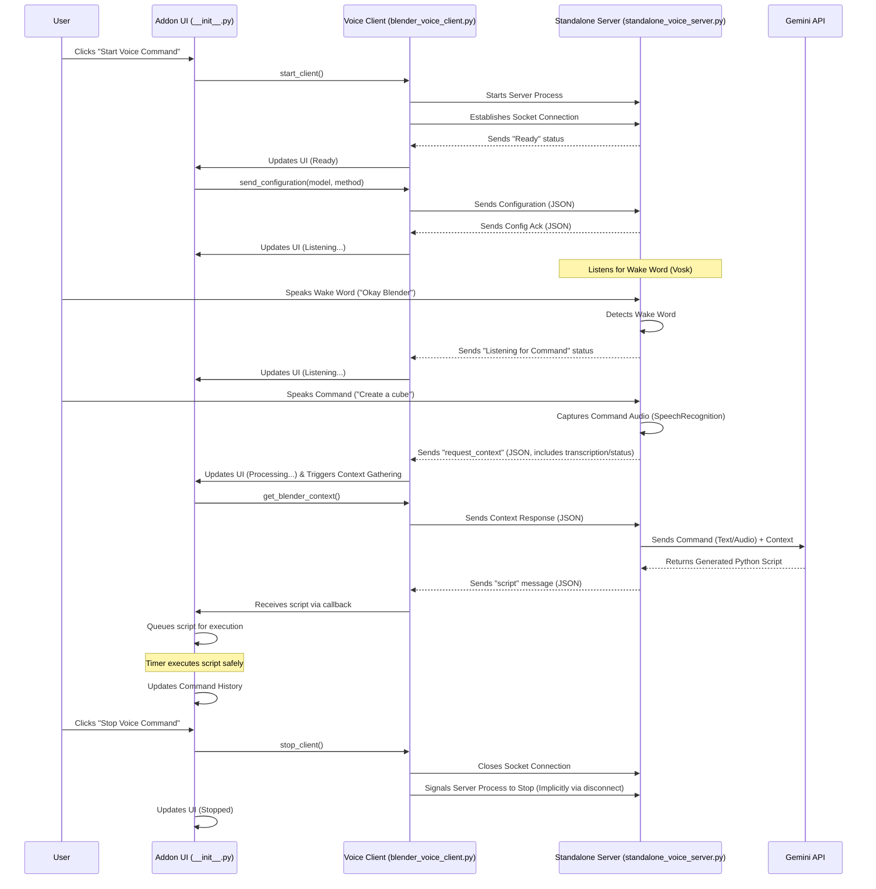
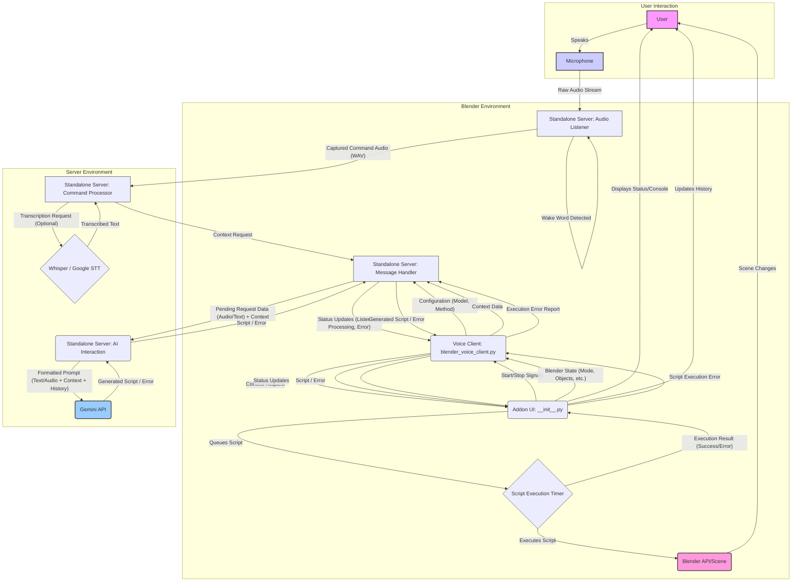

# Articulate 3D - Project Documentation

This document provides a detailed explanation of the Articulate 3D Blender addon, covering its architecture, components, setup, and workflow.

## 1. Introduction

Articulate 3D is a Blender addon designed to enable users to interact with and manipulate 3D scenes using voice commands. It leverages external Python libraries and the Google Gemini AI to understand natural language commands, translate them into Blender Python scripts (`bpy`), and execute them.

The core challenge addressed is integrating complex Python dependencies (like AI SDKs, speech recognition libraries) with Blender's own Python environment without causing conflicts. This is achieved by running a separate, standalone Python server process in its own virtual environment.

## 2. Architecture Overview

The system comprises three main components:

1.  **Standalone Voice Server (`src/standalone_voice_server.py`)**:
    *   Runs as an independent Python process in a dedicated virtual environment (`env` or `env_linux`).
    *   Handles all heavy processing: wake word detection, audio capture, speech-to-text transcription (optional), interaction with the Gemini AI API, and script generation.
    *   Communicates with the Blender Voice Client via TCP sockets.

2.  **Blender Voice Client (`blender_voice_client.py`)**:
    *   Runs within Blender's Python environment.
    *   Acts as a bridge between the Blender Addon UI and the Standalone Server.
    *   Starts the server process.
    *   Establishes and maintains the socket connection to the server.
    *   Sends configuration (API key, selected model, method) and context data to the server.
    *   Receives status messages, context requests, and generated scripts from the server.
    *   Passes received information and scripts to the main addon code (`__init__.py`).

3.  **Blender Addon (`__init__.py`)**:
    *   Provides the user interface (UI panel) within Blender's 3D View sidebar.
    *   Manages the addon's state (e.g., listening status, API key).
    *   Initiates the start/stop sequence via the Voice Client.
    *   Receives messages from the Voice Client callback.
    *   Queues received scripts for safe execution in Blender's main thread via a timer.
    *   Displays status messages, console output, and command history in the UI.
    *   Handles user interactions like executing history items or starring commands.

**Communication Flow:**

**Data Flow Diagram:**

## 3. Setup and Installation (`setup.py`)

The `setup.py` script is crucial for preparing the addon's environment *before* installation into Blender.

*   **Purpose**: To create an isolated Python virtual environment and install all necessary dependencies without interfering with Blender's internal Python.
*   **Process**:
    1.  Determines the correct virtual environment directory name based on the operating system (`env` for Windows, `env_linux` for others).
    2.  Creates the virtual environment using Python's built-in `venv` module if it doesn't exist.
    3.  Identifies the Python executable within the newly created virtual environment.
    4.  Installs PyTorch (CPU version) first using a specific index URL.
    5.  Reads the remaining dependencies from `requirements.txt`.
    6.  Installs these dependencies into the virtual environment using `pip` (invoked via the virtual environment's Python executable).
    7.  Copies `.env.example` to `.env` if `.env` doesn't exist, prompting the user to add their API key.
*   **Outcome**: A self-contained folder (`env` or `env_linux`) within the addon directory containing the necessary Python interpreter and all required libraries. This entire structure (including the `env` folder) is then zipped for installation into Blender.

## 4. Dependencies (`requirements.txt`)

This file lists the specific Python packages required by the **Standalone Voice Server**. Key dependencies include:

*   `google-generativeai`: The official Google client library for interacting with the Gemini API.
*   `google-cloud-speech`: For using Google Cloud Speech-to-Text (optional method).
*   `openai-whisper`: For using the Whisper transcription model (optional method).
*   `vosk`: For offline wake word detection.
*   `SpeechRecognition`: For capturing command audio after the wake word.
*   `PyAudio`: Required by `SpeechRecognition` and `Vosk` for accessing the microphone audio stream.
*   `websockets`: Although listed, the current implementation uses standard TCP sockets (`socket` module). This might be a remnant or for future use.
*   `python-dotenv`: For loading API keys from the `.env` file.
*   `numpy`, `torch`, `torchaudio`: Numerical and audio processing libraries, likely dependencies for Whisper or other audio tasks.

The `setup.py` script ensures these (and their own dependencies) are installed into the dedicated virtual environment.

## 5. Standalone Voice Server (`src/standalone_voice_server.py`)

This is the core processing engine.

*   **Initialization**:
    *   Sets up logging to both console and a file (`articulate3d_server.log`).
    *   Loads the `GEMINI_API_KEY` from the `.env` file or system environment variables. Exits if the key is missing.
    *   Attempts to configure the `google.generativeai` library globally with the API key.
    *   Imports necessary libraries and performs a dependency check, exiting if core components are missing.
    *   Defines server constants (HOST, PORT), state variables, and configurations for Vosk and SpeechRecognition.
*   **Socket Server**:
    *   Creates a TCP socket server listening on `127.0.0.1:65432`.
    *   Accepts incoming connections from the Blender Voice Client.
    *   For each connection, it spawns two threads:
        *   `client_message_handler_thread`: Handles receiving and processing messages *from* the client.
        *   `server_audio_listener_thread`: Handles listening for the wake word and capturing command audio *from* the microphone.
*   **Message Handling (`client_message_handler_thread`)**:
    *   Receives messages framed with a 4-byte length header.
    *   Decodes JSON messages from the client.
    *   Handles message types:
        *   `configure`: Receives model and method settings, stores them per connection, and initializes/resets a Gemini chat session (`model.start_chat()`) for that client to maintain conversation history.
        *   `context_response`: Receives Blender context data requested for a specific command (`request_id`). It retrieves the pending command data (text or audio), calls the appropriate Gemini processing function (`process_text_with_chat` or `process_audio_with_chat`), handles retries if the first attempt fails or if an `execution_error` was previously reported for this `request_id`, and sends the resulting script (or an error) back to the client.
        *   `process_text`: Handles direct text commands sent from the addon (e.g., potentially from a text input field in the future or for retries). It gathers context, processes the text using `process_text_with_chat`, and sends the script back.
        *   `execution_error`: Receives reports from the client when a generated script fails during execution in Blender. Stores the error details associated with the `request_id` to enable informed retries during the next `context_response` processing for that ID.
*   **Audio Listening (`server_audio_listener_thread`)**:
    *   Initializes PyAudio and opens an audio input stream.
    *   Loads the Vosk wake word model.
    *   Initializes a Vosk recognizer with the specified wake words (`WAKE_WORDS`).
    *   Enters a loop:
        *   **Idle State**: Reads audio chunks from the PyAudio stream and feeds them to the Vosk recognizer.
        *   **Wake Word Detected**: If Vosk detects a wake word:
            *   Sends a status update to the client.
            *   Temporarily stops the Vosk audio stream.
            *   Uses the `SpeechRecognition` library to listen for a command phrase via the microphone (`sr.Recognizer().listen()`).
            *   If audio is captured:
                *   Converts the captured audio to WAV format.
                *   Optionally saves the audio to `temp_audio/` for debugging.
                *   Calls `process_captured_command`.
            *   Restarts the Vosk audio stream.
            *   Returns to the Idle State.
*   **Command Processing (`process_captured_command`)**:
    *   Triggered by the audio listener after command capture.
    *   Retrieves the client's configuration (method, model).
    *   Based on the method:
        *   `gemini`: Prepares the WAV audio data.
        *   `whisper`/`google_stt`: Transcribes the audio using the respective function (`transcribe_with_whisper` or `transcribe_with_google_stt`).
    *   If audio/text is ready, stores it in `pending_context_requests` with a unique `request_id`.
    *   Sends a `request_context` message back to the client, including the `request_id` and any transcription result.
*   **AI Interaction (`process_text_with_chat`, `process_audio_with_chat`)**:
    *   Uses the Gemini API via the `google-generativeai` library.
    *   Crucially uses `ChatSession` objects (`model.start_chat()`) stored per client connection (`client_chat_sessions`) to allow the AI to remember previous turns in the conversation.
    *   Formats the Blender context (`format_blender_context`) and the user command (text or audio) into a prompt suitable for Gemini.
    *   Includes specific instructions in the prompt to guide the AI towards generating valid Blender 4.x `bpy` scripts, prioritizing `bpy.data` over `bpy.ops`, and handling errors.
    *   Includes logic to construct specific retry prompts if script execution failed previously (`execution_error` received) or if the initial generation attempt failed.
    *   Sends the request to the Gemini API using `chat_session.send_message()`.
    *   Parses the response to extract the Python script.
    *   Returns the script or `None` if generation fails or is blocked.
*   **Transcription (`transcribe_with_whisper`, `transcribe_with_google_stt`)**:
    *   Provides functions to convert audio bytes (WAV format expected) into text using either the local Whisper model or the Google Cloud STT API.
    *   Whisper implementation loads the model (`small` by default) and uses a temporary file for processing.
    *   Google STT uses the `google-cloud-speech` client library, requiring appropriate authentication (service account key or default credentials).

## 6. Blender Voice Client (`blender_voice_client.py`)

This script acts as the intermediary within Blender's environment.

*   **Server Management**:
    *   `start_voice_server()`: Locates the correct Python executable in the addon's virtual environment (`env` or `env_linux`) and uses `subprocess.Popen` to launch the `standalone_voice_server.py` script as a separate process.
*   **Connection Handling**:
    *   `connect_to_server()`: Attempts to establish a TCP socket connection to the server (`127.0.0.1:65432`) with multiple retries.
*   **Message Reception (`receive_messages`)**:
    *   Runs in a separate thread (`client_thread`).
    *   Continuously listens for incoming data on the socket.
    *   Uses a buffer (`message_buffer`) to handle potentially fragmented messages.
    *   Attempts to decode complete JSON objects from the buffer. **Note:** The current implementation reads raw bytes and decodes assuming JSON, which might be less robust than the server's framed message sending. It should ideally be updated to read the 4-byte header first, then the exact payload size, similar to the server's `client_message_handler_thread`.
    *   Calls the provided `callback` function (which is `process_voice_client_message` in `__init__.py`) for each successfully decoded message.
*   **Message Sending**:
    *   Uses a helper function `send_framed_message` to encode messages as JSON, prepend a 4-byte length header (network byte order), and send them over the socket.
    *   `send_configuration()`: Sends the selected model and method.
    *   `send_context_response()`: Sends the gathered Blender context for a specific `request_id`.
    *   `send_text_command()`: Sends a direct text command along with the current context.
    *   `send_execution_error()`: Sends details about a script execution failure back to the server, linked by `request_id`.
*   **Context Gathering (`get_blender_context`)**:
    *   Safely accesses `bpy.context` properties (mode, scene name, active object details, selected object details, all scene object names) to create a dictionary representing the current state of the Blender scene.
*   **Lifecycle (`start_client`, `stop_client`)**:
    *   `start_client`: Initiates the server process, connects to it, and starts the message receiving thread.
    *   `stop_client`: Sets a `stop_flag` to signal the receiving thread to exit and closes the socket connection.

## 7. Blender Addon UI & Logic (`__init__.py`)

This file defines the Blender-specific parts.

*   **`bl_info`**: Standard addon metadata.
*   **Properties (`VoiceCommandProperties`)**: Defines properties stored in the scene:
    *   `is_listening`: Boolean flag for UI state.
    *   `api_key`: Stores the Gemini API key (masked in UI). Updates `.env` file when changed.
    *   `selected_model`: Enum for choosing the Gemini model.
    *   `audio_method`: Enum for choosing the processing method (Gemini direct, Whisper, Google STT).
    *   `console_output`: String to display status messages in the panel.
    *   `show_history`, `show_starred`: Booleans to control UI section visibility.
*   **Operators**:
    *   `BLENDER_OT_voice_command`: Starts the process. Validates the API key, updates `.env`, calls `blender_voice_client.start_client`, sends the initial configuration, and registers the script execution timer.
    *   `BLENDER_OT_stop_voice_command`: Calls `blender_voice_client.stop_client` and unregisters the timer.
    *   `BLENDER_OT_execute_history_command`: Executes a script stored in the `command_history` or `starred_commands` list based on the provided index. Adds a new entry to history indicating the re-execution attempt and its result.
    *   `BLENDER_OT_toggle_star_history_command`: Toggles the 'starred' status of an item in `command_history` and updates the separate `starred_commands` list accordingly.
    *   `BLENDER_OT_delete_history_command`: Removes an item from the `command_history` list (does not affect starred list directly).
*   **Panel (`BLENDER_PT_voice_command_panel`)**:
    *   Defines the layout of the addon panel in the 3D View sidebar.
    *   Displays configuration options (API key, model, method).
    *   Shows status and console output.
    *   Provides Start/Stop buttons.
    *   Includes collapsible sections for Command History and Starred Commands.
    *   Dynamically draws history items with buttons for execution, starring/unstarring, and deletion.
*   **Message Handling (`process_voice_client_message`)**:
    *   The callback function passed to `blender_voice_client`.
    *   Receives messages (dictionaries or strings) from the client thread.
    *   Updates the UI console (`update_console`).
    *   Handles `request_context` messages by triggering context gathering and sending the response via `blender_voice_client.send_context_response`. It also stores the transcription associated with the `request_id` in `pending_transcriptions`.
    *   Handles `script` messages by retrieving the associated transcription from `pending_transcriptions` (using `request_id`), queuing the script and transcription (`script_queue.append`), and logging the outcome to `command_history`.
    *   Handles `error` messages by logging them and adding an error entry to `command_history`.
*   **Script Execution (`execute_scripts_timer`)**:
    *   A Blender timer function (`bpy.app.timers.register`) that runs periodically (every 1 second).
    *   Checks the `script_queue`.
    *   If a script is present, it dequeues it (`script_queue.pop(0)`).
    *   Executes the script using Python's `exec()` function within a `try...except` block.
    *   Updates the `command_history` with the execution result (Success or Script Error).
    *   If a script error occurs, it calls `blender_voice_client.send_execution_error` to report the failure back to the server, including the original `request_id`.
    *   Tags the UI for redraw if necessary. This ensures scripts are run in Blender's main thread, avoiding context issues.
*   **History Management**:
    *   Uses a `collections.deque` for `command_history` to keep a limited number of recent commands.
    *   Uses a standard list for `starred_commands`.
    *   Provides helper functions (`find_history_entry_by_timestamp`, `find_starred_entry_by_timestamp`) for linking starred items back to their original history entry.

## 8. Logging

*   Both the addon (`__init__.py`) and the server (`standalone_voice_server.py`) implement logging.
*   Logs are written to the Blender console and dedicated files (`articulate3d_addon.log`, `articulate3d_server.log`) in the addon's root directory.
*   This helps in debugging issues occurring in either the Blender environment or the separate server process.

## 9. Potential Improvements / Considerations

*   **Client Message Reception**: The client's `receive_messages` function should be updated to use framed message receiving (reading the 4-byte header first) to match the server's sending logic for better robustness.
*   **Error Handling**: More specific error handling and reporting could be implemented throughout the communication chain.
*   **Server Stability**: The server could be made more robust against unexpected client disconnections or malformed messages.
*   **Resource Management**: Ensure audio streams and server processes are consistently cleaned up, especially on errors or unexpected shutdowns.
*   **Starred Command Persistence**: Currently, the `starred_commands` list is in-memory and will be lost when Blender closes. This could be saved to a file (e.g., JSON) for persistence.
*   **History Linking**: Linking starred commands back to the main history via timestamp might be fragile if the main history clears or timestamps collide. Storing the original history index within the starred item might be more robust, but requires careful management if history items are deleted.
